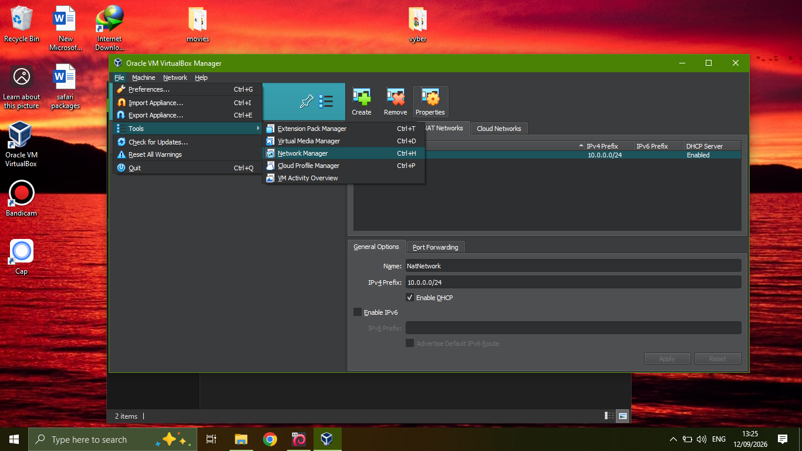
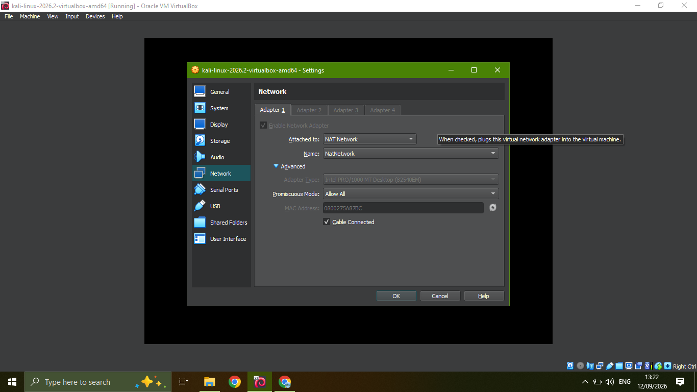
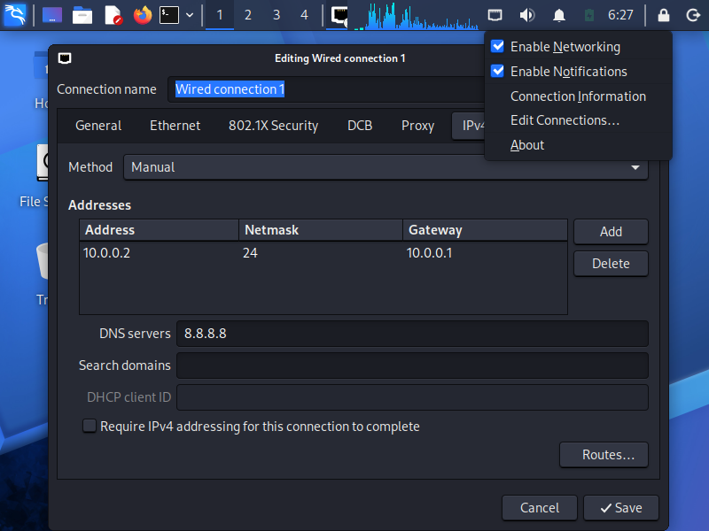
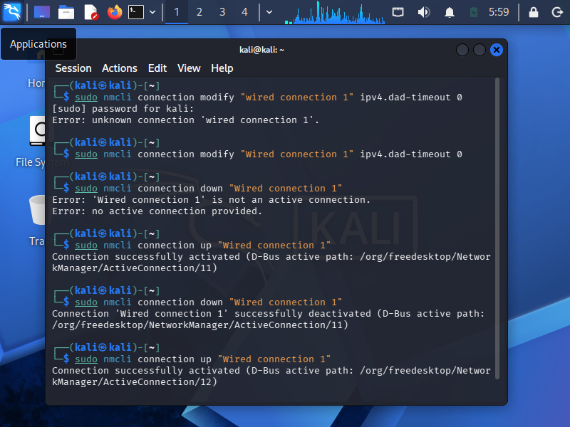
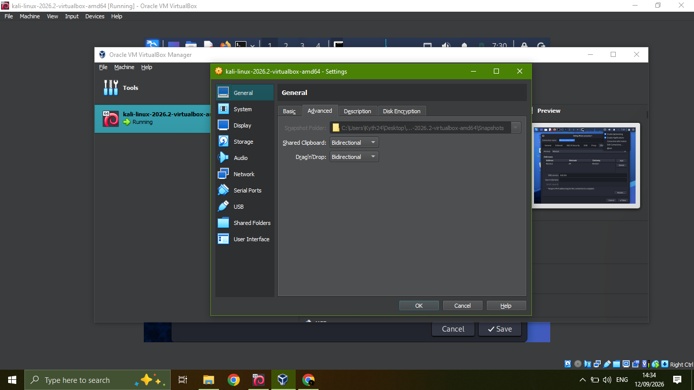
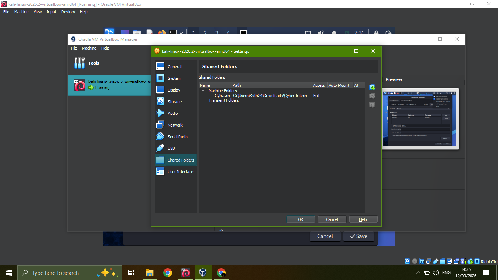

# WK1-PM1 — Cybersecurity Testing Lab Environment Setup

**Course:** Cybersecurity & Ethical Hacking — Networkwalks Academy
**Task:** Setup a Cybersecurity testing lab environment using VirtualBox + Kali Linux on a custom NAT Network.

Full write-up: [`WK1-PM1_Lab_Setup_Report.pdf`](./WK1-PM1_Lab_Setup_Report.pdf)

## Summary

| Component | Configuration |
|---|---|
| Hypervisor | Oracle VirtualBox (latest version) |
| Attack VM | Kali Linux |
| Network Type | Custom NAT Network (not default NAT/Bridged) |
| Network Name | `NatNetwork` |
| Subnet / IPv4 Prefix | `10.0.0.0/24` |
| DHCP | Enabled on the NAT Network |
| Kali IP Addressing | Manual — `10.0.0.2/24`, Gateway `10.0.0.1` |
| DNS | `8.8.8.8` |

## Evidence

**1. Custom NAT Network created (10.0.0.0/24, DHCP enabled)**


**2. Kali Linux VM — Adapter 1 attached to the NAT Network**


**3. Kali Linux static IP configuration (10.0.0.2/24, gateway 10.0.0.1, DNS 8.8.8.8)**


**4. Resolving an internet connectivity issue via `nmcli`**


```bash
sudo nmcli connection modify "Wired connection 1" ipv4.dad-timeout 0
sudo nmcli connection down "Wired connection 1"
sudo nmcli connection up "Wired connection 1"
```

**5. Shared Clipboard & Drag'n'Drop set to Bidirectional**


**6. Shared folder mounted from the host with Full access**


## Requirements checklist

- [x] VirtualBox installed and used as the base hypervisor
- [x] Kali Linux set up as the attacking/hacker machine
- [x] Lab network created in subnet 10.0.0.0/24
- [x] Custom NAT Network (`NatNetwork`) used for 10.0.0.0/24
- [x] Kali Linux IP address set to 10.0.0.2/24
- [x] Kali Linux confirmed to have full internet access
- [x] Clipboard sharing & drag-and-drop enabled in VM settings (Bidirectional)
- [x] Shared folder enabled from host machine, mounted with Full access

> **Note:** the shared folder currently maps `C:\Users\Kyth24\Downloads\Cyber Intern` — a subfolder inside the host's Downloads directory — rather than the Downloads folder itself. Functionally this still gives Kali access to shared files; if the requirement needs the literal Downloads root shared, either re-map the shared folder to Downloads directly, or note the subfolder choice in your submission comments.
